# Podręcznik użytkownika

## 1. Instalacja i wstępna konfiguracja

### 1.1 Wymagania systemowe

Aplikacja wymaga:

* Windows 10 lub nowszy
* Zalecana rozdzielczość ekranu co najmniej 1920×1080

> **Uwaga:** Wersja macOS może działać, jednak wersja Windows jest zalecana dla stabilnego działania.

### 1.2 Pobieranie aplikacji

1. [Otwórz stronę GitHub Releases projektu.](https://github.com/BiometricsUBB/Forensic-Biometrics-Studio/releases)
2. Znajdź najnowsze stabilne wydanie.
3. Rozwiń sekcję **Assets**.
4. Pobierz pakiet instalacyjny.

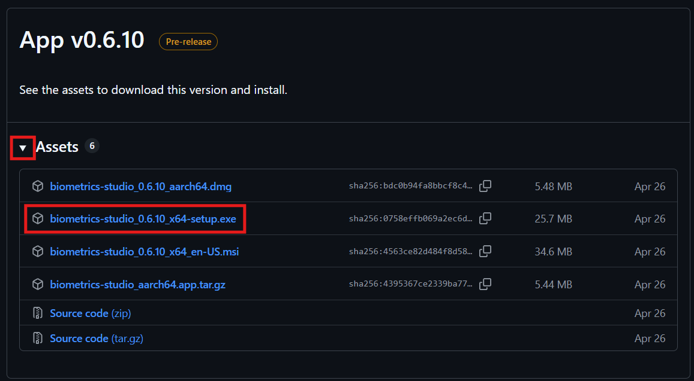

*Pobieranie aplikacji ze strony GitHub Releases.*

### 1.3 Uruchamianie instalatora

1. Uruchom pobrany instalator.
2. Windows SmartScreen może wyświetlić ostrzeżenie informujące, że aplikacja jest nierozpoznana.
3. Kliknij **Więcej informacji**.
4. Kliknij **Uruchom mimo to**.
5. Przejdź przez kreator instalacji, wybierając **Next**, aż do zakończenia instalacji.

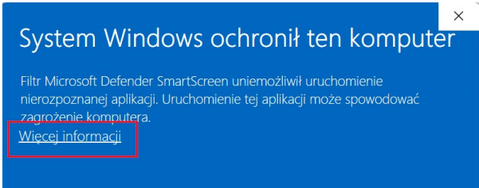

*Ostrzeżenie Windows SmartScreen.*

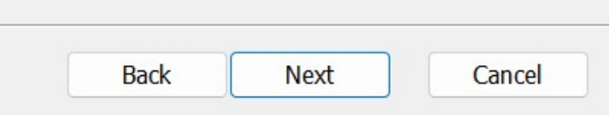

*Kreator instalacji.*

### 1.4 Pierwsze uruchomienie

Po instalacji uruchom aplikację za pomocą skrótu na pulpicie lub z Menu Start.

Po uruchomieniu oprogramowanie wyświetli monit o wybranie trybu pracy.

Tryb ten można zmienić później za pomocą menu **Tryb pracy**.

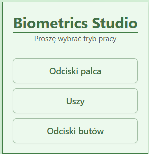

*Wybór trybu pracy.*

### 1.5 Ustawienia aplikacji

Okno Ustawień umożliwia konfigurację:

* Języka
* Motywu jasnego lub ciemnego
* Zachowania interfejsu

Aby otworzyć okno Ustawień, kliknij ikonę zębatki na pasku narzędzi.

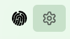

*Ustawienia aplikacji.*

### 1.6 Importowanie predefiniowanych typów cech

Po instalacji aplikacja nie zawiera predefiniowanych definicji cech. Definicje te należy zaimportować z dostarczonych plików predefiniowanych.

Aby zaimportować ustawienia wstępne:

1. Otwórz **Ustawienia**.
2. Otwórz okno **Typy**.
3. Kliknij ikonę **Importuj**.
4. Wybierz plik predefiniowanych ustawień odcisków palców. W folderze znajdować się będzie zarówno polska jak i angielska wersja językowa oznaczeń. Wybierz jedną.
5. Potwierdź import.

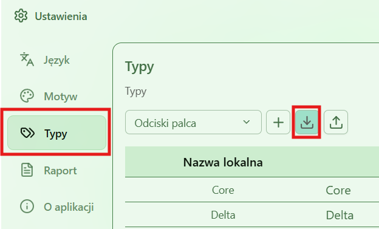

*Zarządzanie typami cech.*

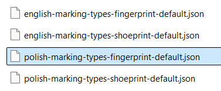

*Importowanie predefiniowanych ustawień odcisków palców.*

Zaimportowane definicje obejmują standardowe typy cech odcisków palców używane w całym niniejszym podręczniku.

> **Ważne:** Nie zmieniaj nazw ani nie usuwaj istniejących definicji cech, chyba że celowo chcesz utworzyć konfigurację niestandardową.

### 1.7 Zalecana konfiguracja środowiska pracy

Dla najbardziej komfortowego przepływu pracy:

* Używaj aplikacji w trybie zmaksymalizowanego okna.
* Używaj myszy zamiast touchpada, gdy tylko jest to możliwe.
* Włącz Tryb ciemny podczas pracy w warunkach słabego oświetlenia.
* Używaj wyświetlacza wysokiej rozdzielczości do szczegółowych badań kryminalistycznych.

---

## 2. Podstawowy przepływ pracy – Porównanie odcisków palców

W tej sekcji przedstawiono zalecany przepływ pracy z użyciem obrazów odcisków palców.

### 2.1 Wczytywanie obrazów

Aplikacja jest zaprojektowana do jednoczesnego porównywania dwóch obrazów.

Aby wczytać obrazy:

1. Kliknij ikonę wczytywania obrazu w lewym panelu.
2. Wybierz pierwszy obraz odcisku palca.
3. Kliknij ikonę wczytywania obrazu w prawym panelu.
4. Wybierz drugi obraz odcisku palca.

Po wczytaniu oba obrazy powinny być widoczne obok siebie.

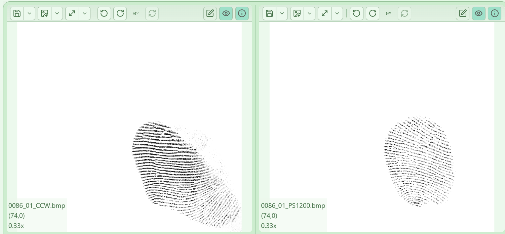

*Wczytywanie dwóch obrazów odcisków palców.*

### 2.2 Nawigacja po obrazach

Domyślnym narzędziem nawigacji jest **Narzędzie przesuwania**.

Aby przesunąć obraz:

1. Wybierz ikonę dłoni.
2. Kliknij i przeciągnij obraz.

Podczas przesuwania obrazu wyświetlane są linie referencyjne ułatwiające wyrównanie.

Podczas porównywania odcisków palców zaleca się ustawienie obrazu tak, aby przybliżone centrum wzoru odcisku palca (obszar Core) znajdowało się w centrum obszaru wyświetlania.


*Narzędzie przesuwania.*

### 2.3 Powiększanie

Używaj kółka myszy do powiększania i pomniejszania.

Powiększanie jest niezbędne podczas oznaczania:

* Minucji
* Porów
* Cech krawędziowych
* Małych blizn
* Szczegółów listewek

Oprogramowanie zachowuje położenie cech niezależnie od poziomu powiększenia.

### 2.4 Wyrównywanie obrazów

Przed rozpoczęciem oznaczania cech:

1. Zlokalizuj obszar Core na lewym obrazie.
2. Wyśrodkuj obraz.
3. Powtórz tę czynność dla prawego obrazu.

Oba obrazy powinny być w przybliżeniu wyrównane przed rozpoczęciem porównania.

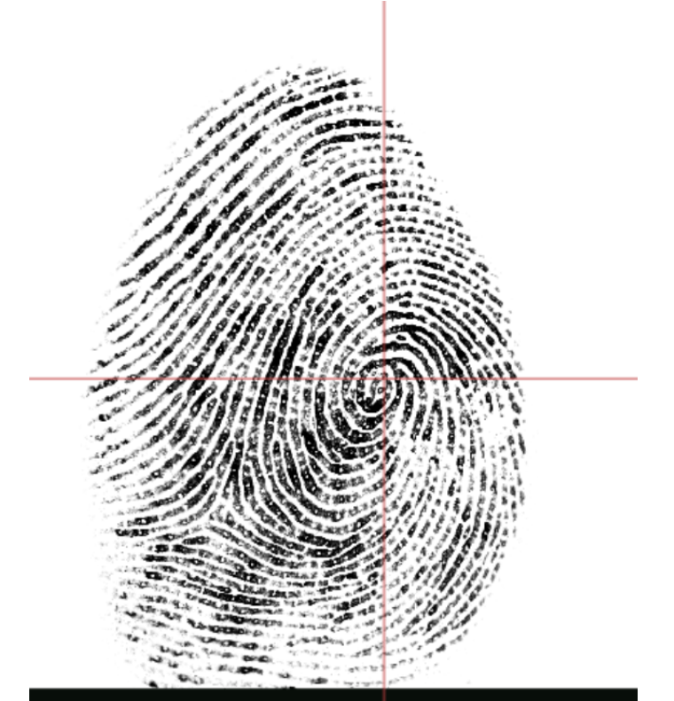

*Wyrównywanie obrazów wokół obszaru Core.*

### 2.5 Blokowanie obrazów

Po wyrównaniu obu obrazów można je zsynchronizować.

Aby włączyć synchronizację:

1. Kliknij ikonę kłódki.

Gdy blokowanie obrazu jest aktywne:

* Przesuwanie jednego obrazu przesuwa oba obrazy.
* Powiększanie jednego obrazu powiększa oba obrazy.
* Nawigacja pozostaje zsynchronizowana.

Znacznie upraszcza to porównywanie cech.


*Narzędzie blokowania.*

### 2.6 Przełączanie do trybu oznaczania cech

Aby rozpocząć oznaczanie cech:

1. Kliknij ikonę celownika.
2. Wybierz typ cechy z listy cech.

Aktualnie wybrany typ cechy jest wyświetlany w polu wyboru cech.

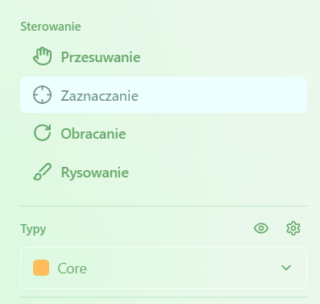

*Tryb oznaczania cech.*

### 2.7 Zalecana procedura oznaczania

Oprogramowanie jest zaprojektowane z myślą o naprzemiennym wprowadzaniu cech.

Zalecany przepływ pracy:

1. Oznacz cechę na lewym obrazie.
2. Oznacz odpowiadającą cechę na prawym obrazie.
3. Kontynuuj naprzemienne przełączanie między obrazami.

Takie podejście automatycznie tworzy prawidłowe pary cech i zmniejsza liczbę błędów przypisania.

Poniższe rozdziały szczegółowo opisują dostępne typy cech odcisków palców oraz zaawansowane techniki parowania.

### 2.8 Oznaczanie Core

Core jest jedną z najważniejszych cech referencyjnych w porównaniu odcisków palców i zazwyczaj jest oznaczane przed innymi charakterystykami.

Aby oznaczyć Core:

1. Upewnij się, że **Tryb oznaczania cech** jest aktywny.
2. Wybierz **Core** z listy typów cech.
3. Zlokalizuj centralny obszar wzoru odcisku palca.
4. Kliknij raz w miejscu Core na pierwszym obrazie.
5. Kliknij raz w odpowiadającym miejscu Core na drugim obrazie.

Core jest reprezentowany jako cecha punktowa, dlatego wymaga tylko jednego kliknięcia.

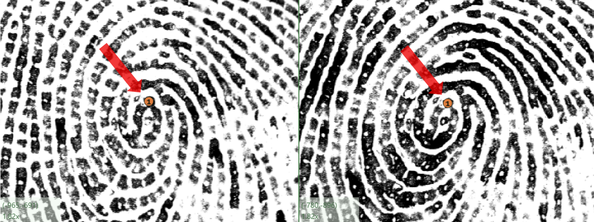

*Oznaczanie cechy Core.*

### 2.9 Oznaczanie Delty

Delta to charakterystyczny trójkątny lub trójpromienny obszar utworzony przez rozbiegające się przepływy listewek.

Aby oznaczyć Deltę:

1. Wybierz **Delta** z listy typów cech.
2. Zlokalizuj Deltę na pierwszym obrazie.
3. Kliknij raz, aby zaznaczyć jej położenie.
4. Oznacz odpowiadającą Deltę na drugim obrazie.

Podobnie jak Core, Delta jest reprezentowana jako cecha punktowa.

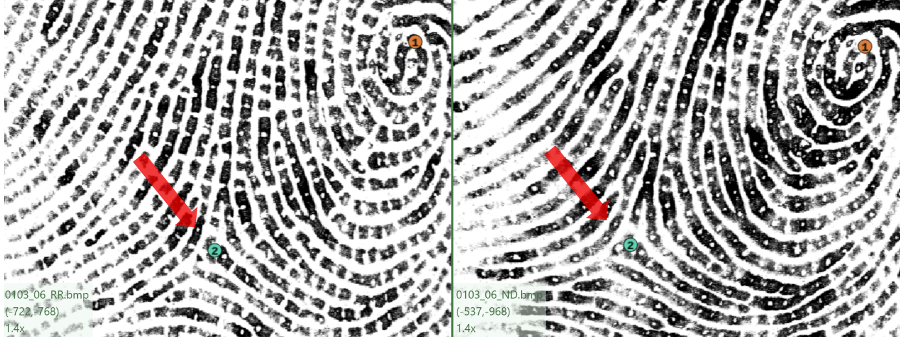

*Oznaczanie cechy Delty.*

### 2.10 Skierowane minucje

Wiele cech odcisków palców to cechy kierunkowe.

W odróżnieniu od cech punktowych, cechy kierunkowe wymagają dwóch kliknięć:

1. Pierwsze kliknięcie definiuje punkt początkowy cechy.
2. Drugie kliknięcie definiuje kierunek.

Przykłady obejmują:

* Początek linii
* Zakończenie linii
* Rozwidlenie
* Złączenie linii

### 2.11 Zakończenie linii

Zakończenie linii oznacza zakończenie biegu listewki.

Aby oznaczyć Zakończenie linii:

1. Wybierz **Zakończenie linii**.
2. Kliknij punkt zakończenia listewki.
3. Przesuń kursor w kierunku przebiegu listewki.
4. Kliknij ponownie, aby potwierdzić kierunek.

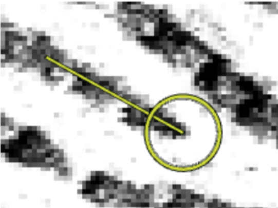

*Zakończenie linii.*

### 2.12 Początek listewki

Początek linii oznacza początek biegu listewki.

Aby oznaczyć Początek listewki:

1. Wybierz **Początek linii**.
2. Kliknij punkt początkowy listewki.
3. Wskaż kierunek przebiegu listewki.
4. Potwierdź drugim kliknięciem.

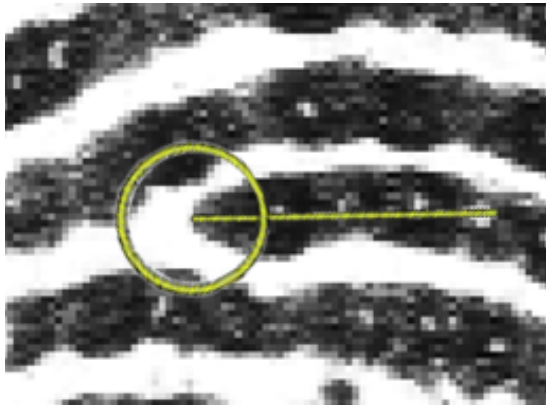

*Początek linii.*

### 2.13 Rozwidlenie

Rozwidlenie występuje, gdy listewka rozdziela się na dwie gałęzie.

Aby oznaczyć Rozwidlenie:

1. Wybierz **Rozwidlenie**.
2. Kliknij miejsce rozwidlenia.
3. Wskaż kierunek listewki.
4. Potwierdź drugim kliknięciem.

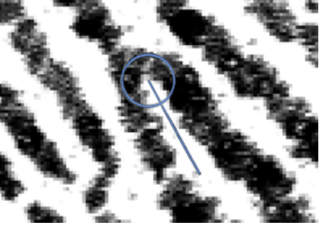

*Rozwidlenie.*

### 2.14 Złączenie linii

Złączenie linii jest odwrotnością rozwidlenia i oznacza połączenie dwóch listewek w jedną.

Aby oznaczyć Złączenie linii:

1. Wybierz **Złączenie linii**.
2. Kliknij miejsce połączenia listewek.
3. Zdefiniuj kierunek.
4. Potwierdź drugim kliknięciem.

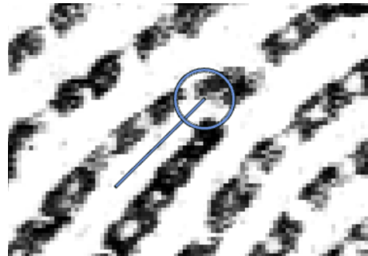

*Złączenie linii.*

### 2.15 Zrozumienie parowania cech

Oprogramowanie jest zoptymalizowane pod kątem naprzemiennego wprowadzania cech.

Przykład:

1. Oznacz Cechę 1 na lewym obrazie.
2. Oznacz Cechę 1 na prawym obrazie.
3. Oznacz Cechę 2 na lewym obrazie.
4. Oznacz Cechę 2 na prawym obrazie.

Ten przepływ pracy automatycznie tworzy pasujące identyfikatory cech.

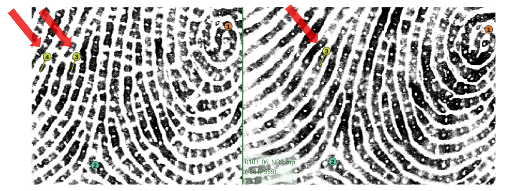

*Naprzemienny sposób wprowadzania cech.*

### 2.16 Wybieranie istniejących cech

Każda oznaczona cecha pojawia się w tabeli cech poniżej obrazu.

Wybranie wiersza w tabeli:

* Podświetla cechę na obrazie.
* Ułatwia przeglądanie adnotacji.
* Umożliwia korekty i usunięcia.

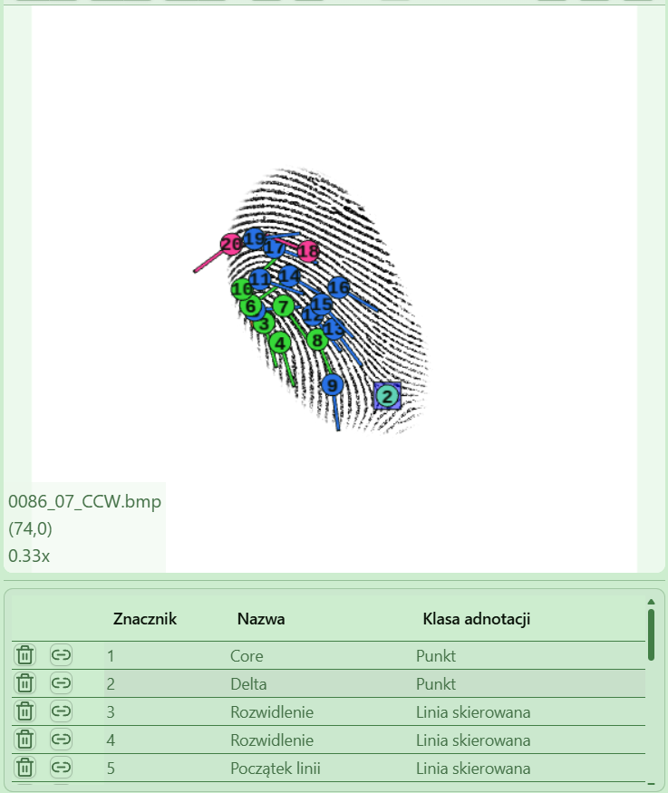

*Tabela cech i selekcja.*

### 2.17 Usuwanie cech

Nieprawidłowe adnotacje można usunąć w dowolnym momencie.

Aby usunąć cechę:

1. Wybierz cechę w tabeli.
2. Kliknij ikonę kosza.
3. Potwierdź usunięcie, jeśli pojawi się monit.


*Usuwanie adnotacji.*

### 2.18 Praca z adnotacjami nieprzemiennymi

Chociaż zalecane jest naprzemienne wprowadzanie cech, możliwe jest również oznaczenie wielu cech na jednym obrazie przed oznaczeniem ich odpowiedników.

Przykład:

1. Oznacz cechy 4, 5, 6 i 7 na lewym obrazie.
2. Przełącz się na prawy obraz.
3. Dodaj pasujące cechy.

W tej sytuacji oprogramowanie może automatycznie kontynuować numerację zamiast przypisywać zamierzone identyfikatory par.

Aby to skorygować:

1. Wybierz pusty wiersz odpowiadający żądanemu identyfikatorowi.
2. Oznacz pasującą cechę.
3. Powtarzaj aż wszystkie pary zostaną prawidłowo przypisane.

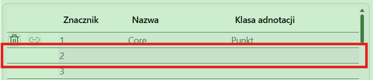

*Korygowanie przypisań par cech.*

---

## 3. Zapisywanie i wczytywanie pracy

### 3.1 Zapisywanie adnotacji cech

Adnotacje cech są przechowywane oddzielnie od oryginalnych plików obrazów.

Aplikacja zapisuje adnotacje jako pliki JSON.

Aby zapisać pracę:

1. Kliknij ikonę zapisu powyżej obrazu.
2. Wybierz miejsce docelowe.
3. Potwierdź nazwę pliku.

Oryginalny obraz pozostaje niezmieniony.

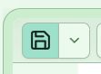

*Zapisywanie adnotacji cech.*

### 3.2 Zalecana organizacja plików

Aplikacja automatycznie sugeruje:

```text
fingerprint.bmp
fingerprint.bmp.json
```

Zdecydowanie zaleca się używanie tego samego katalogu i pasujących nazw plików, ponieważ upraszcza to przyszłe wczytywanie tych plików.

### 3.3 Wczytywanie zapisanych adnotacji

Aby kontynuować poprzednie badanie:

1. Wczytaj plik obrazu.
2. Kliknij ikonę wczytywania adnotacji.
3. Wybierz odpowiadający plik JSON.

Aplikacja przywraca wszystkie zapisane informacje o cechach.

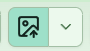

*Wczytywanie poprzednio zapisanej pracy.*

### 3.4 Praca z wieloma porównaniami

Typowy przepływ pracy polega na porównywaniu wielu odcisków z tego samego źródła.

Na przykład:

* Odcisk A vs Odcisk B
* Odcisk A vs Odcisk C
* Odcisk B vs Odcisk C

Każde porównanie może generować oddzielne pliki adnotacji JSON, które można później połączyć za pomocą funkcji Scalania opisanej w następnym rozdziale.

---

## 4. Zaawansowany przepływ pracy

### 4.1 Funkcja scalania

Funkcja scalania pozwala na ujednolicenie identyfikatorów cech z różnych plików adnotacji.

Jest to szczególnie przydatne gdy:

* Przeprowadzono wiele niezależnych porównań.
* Ta sama cecha fizyczna otrzymała różne identyfikatory.
* Istniejące adnotacje wymagają uzgodnienia.

### 4.2 Typowy scenariusz scalania

Rozważmy dwie wcześniej opatrzone adnotacjami pary obrazów.

Ta sama cecha Core może mieć:

* Identyfikator 1 w jednym porównaniu
* Identyfikator 7 w innym porównaniu

Funkcja scalania pozwala połączyć te identyfikatory w jeden wspólny identyfikator.

### 4.3 Scalanie cech

Aby scalić dwie cechy:

1. Wybierz wiersz cechy w pierwszej tabeli.
2. Wybierz odpowiadający wiersz cechy w drugiej tabeli.
3. Kliknij ikonę scalania.
4. Powtórz dla wszystkich pasujących cech.

Oprogramowanie aktualizuje identyfikatory tak, aby odpowiadające cechy miały ten sam numer referencyjny.

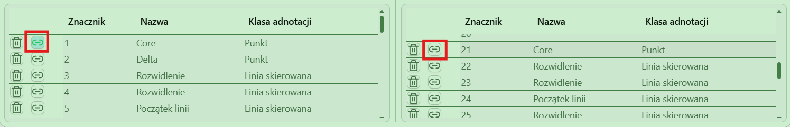

*Scalanie identyfikatorów cech.*

### 4.4 Weryfikacja wyników scalania

Po scaleniu:

* Pasujące cechy powinny wyświetlać identyczne identyfikatory.
* Tabele powinny wykazywać spójną numerację.
* Relacje między cechami powinny pozostać niezmienione.

Zapisz zaktualizowane adnotacje po zakończeniu procesu scalania.

### 4.5 Przegląd narzędzia obrotu

Odciski palców są często rejestrowane pod różnymi kątami.

Narzędzie obrotu pozwala na tymczasowy obrót prawego obrazu w celu uproszczenia porównania cech, zachowując przy tym współrzędne cech.

Pełny przepływ pracy obrotu jest opisany w następnym rozdziale.

### 4.6 Automatyczne narzędzie obrotu

### Cel

Odciski palców są często rejestrowane pod różnymi kątami. Nawet gdy dwa obrazy pochodzą z tego samego palca, różnice w ułożeniu dłoni, umieszczeniu skanera lub warunkach rejestracji mogą skutkować rozbieżnościami w orientacji.

Narzędzie obrotu zapewnia tymczasowy mechanizm wyrównania, który pozwala ekspertowi obrócić prawy obraz, aby dopasować go do orientacji lewego obrazu.

Operacja ta nie modyfikuje oryginalnego pliku obrazu i nie zmienia przechowywanych współrzędnych cech.

### Uruchamianie narzędzia obrotu

Aby uzyskać dostęp do narzędzia:

1. Otwórz porównanie zawierające dwa obrazy odcisków palców.
2. Wybierz **Narzędzie obrotu** z paska bocznego.

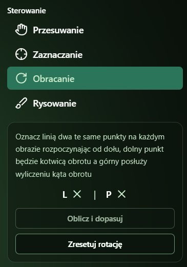

*Otwieranie narzędzia obrotu.*

### Wybieranie linii referencyjnych

Algorytm obrotu wymaga linii referencyjnej na obu obrazach.

Dla najlepszych wyników:

* Wybierz dwa wyraźnie identyfikowalne punkty.
* Użyj punktów widocznych na obu obrazach.
* Narysuj jak najdłuższą linię.
* Upewnij się, że obie linie zaczynają się i kończą w odpowiadających sobie miejscach.

Aby zdefiniować linię referencyjną:

1. Narysuj linię na lewym obrazie.
2. Narysuj odpowiadającą linię na prawym obrazie.

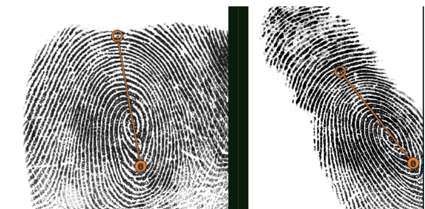

*Definiowanie linii referencyjnych.*

### Obliczanie obrotu

Po utworzeniu obu linii referencyjnych:

1. Kliknij **Oblicz i wyrównaj**.
2. Oprogramowanie oblicza różnicę kątową.
3. Prawy obraz jest automatycznie obracany.

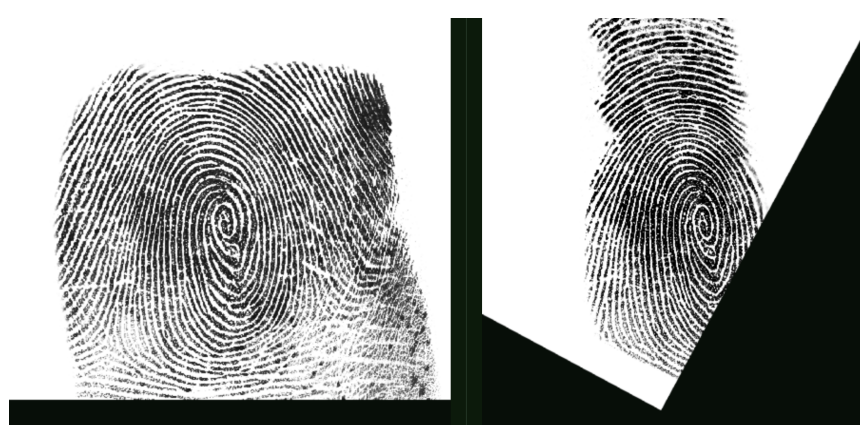

*Wynik automatycznego wyrównania.*

Po obróceniu oba wzory odcisków palców powinny mieć w przybliżeniu tę samą orientację.

### Oznaczanie cech po obróceniu

Po zakończeniu wyrównania:

1. Wróć do Trybu oznaczania cech.
2. Kontynuuj normalne oznaczanie cech.
3. Dodaj nowe cechy zgodnie z wymaganiami.

Wszystkie adnotacje są automatycznie powiązane z oryginalnymi współrzędnymi obrazu.

### Resetowanie obrotu

W dowolnym momencie:

1. Wróć do Narzędzia obrotu.
2. Kliknij **Zresetuj rotację**.

Obraz powraca do swojej oryginalnej orientacji.

Wcześniej oznaczone cechy pozostają poprawnie ustawione względem wzoru odcisku palca.


*Resetowanie obrotu obrazu.*

---

## 5. Funkcje interfejsu

### 5.1 Otwieranie obrazów

Wczytuje nowy obraz do wybranego panelu.

Obsługiwane formaty obrazów zależą od wersji aplikacji.

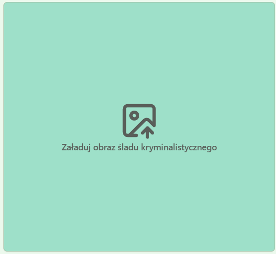

*Narzędzie otwierania obrazu.*

### 5.2 Otwieranie plików adnotacji

Wczytuje wcześniej zapisane adnotacje cech w formacie JSON.

Obraz i plik adnotacji można wczytywać niezależnie.


*Narzędzie otwierania adnotacji.*

### 5.3 Zapisywanie pliku adnotacji

Przechowuje wszystkie informacje o cechach w pliku JSON.

Zapisywane są tylko dane adnotacji.

Obraz źródłowy pozostaje niezmieniony.


*Narzędzie zapisywania adnotacji.*

### 5.4 Dopasowywanie obrazu do okna

Oprogramowanie zapewnia kilka opcji automatycznego dopasowania:

* Dopasuj cały obraz
* Dopasuj szerokość
* Dopasuj wysokość

Narzędzia te upraszczają nawigację po wczytaniu nowego obrazu.

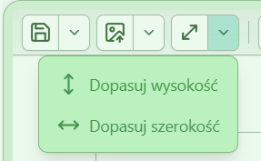

*Narzędzia dopasowywania obrazu.*

### 5.5 Kontrola widoczności cech

Gdy w małym obszarze znajduje się wiele cech, adnotacje mogą przesłaniać ważne szczegóły obrazu.

Kontrola widoczności cech pozwala ekspertowi zmniejszyć wizualną dominację wyświetlanych cech.

Typowe przypadki użycia:

* Gęste obszary minucji
* Analiza porów
* Badanie edgeskopowe


*Kontrolki widoczności cech.*

### 5.6 Ukrywanie nakładek informacyjnych

Aplikacja może wyświetlać:

* Poziom powiększenia
* Współrzędne obrazu
* Wskaźniki pozycji

Te nakładki można ukryć, gdy nie są potrzebne.


*Kontrolki nakładek interfejsu.*

### 5.7 Motywy jasny i ciemny

Aplikacja obsługuje oba motywy:

* Motyw jasny
* Motyw ciemny

Tryb ciemny jest zalecany podczas długich sesji badawczych i w warunkach słabego oświetlenia.

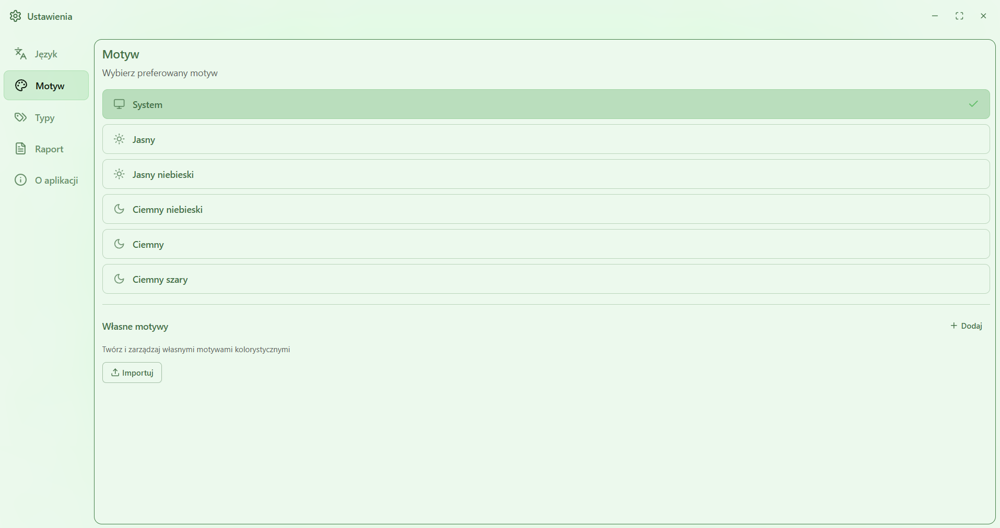

---

# 6. Tryby pracy

## 6.1 Tryb odcisków palców

Tryb odcisków palców zapewnia najbardziej kompletną funkcjonalność dostępną obecnie w aplikacji.

Poniższe sekcje opisują wszystkie obsługiwane typy cech odcisków palców.

---

### Core

Core reprezentuje centrum odcisku palca.

Zazwyczaj znajduje się w pobliżu najbardziej wewnętrznego zagięcia pętli lub struktury wiru.

Core jest oznaczane za pomocą pojedynczego punktu.

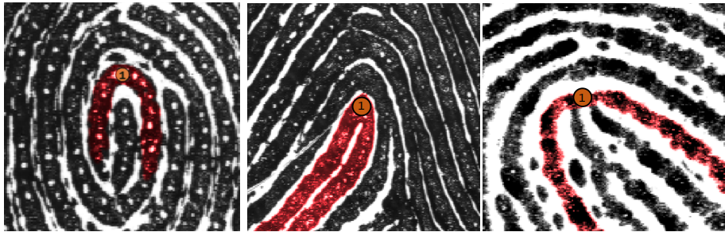

*Core.*

---

### Delta

Delta to trójkątny, trójpromienny lub lejkowaty obszar, w którym przepływ listewek rozbiega się.

Delta służy jako ważna globalna cecha referencyjna.

Cecha jest oznaczana za pomocą pojedynczego punktu.

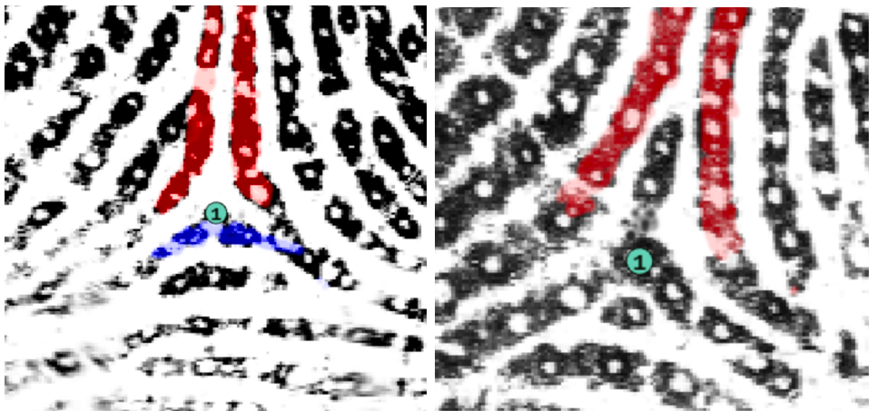

*Delta.*

---

### Początek linii

Reprezentuje początek listewki.

Oznaczana jako cecha kierunkowa.

Pierwsze kliknięcie wskazuje położenie.

Drugie kliknięcie wskazuje kierunek listewki.


*Początek linii.*

---

### Zakończenie linii

Reprezentuje zakończenie listewki.

Oznaczane jako cecha kierunkowa.


*Zakończenie linii.*

---

### Rozwidlenie

Występuje gdy listewka dzieli się na dwie.

Oznaczane jako cecha kierunkowa.


*Rozwidlenie.*

---

### Złączenie linii

Występuje gdy dwie listewki łączą się w jedną.

Oznaczane jako cecha kierunkowa.


*Złączenie linii.*

---

### Haczyk

Haczyk to krótka gałąź listewki wychodząca z dłuższej listewki.

Długość gałęzi nie powinna przekraczać w przybliżeniu odległości między trzema sąsiednimi grzbietami.

Cecha jest oznaczana od punktu rozwidlenia do zakończenia listewki.

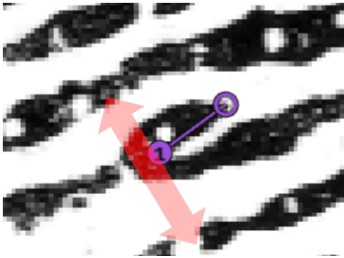

*Haczyk.*

---

### Oczko

Oczko powstaje, gdy listewka rozwidla się, a następnie łączy po krótkim dystansie.

Zamknięty obszar nie powinien przekraczać w przybliżeniu czterech odstępów między sąsiednimi grzbietami.

Cecha jest oznaczana od rozwidlenia do połączenia listewek.

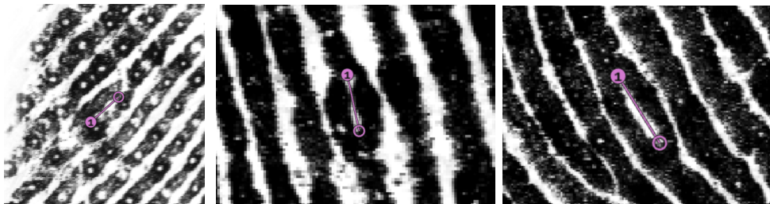

*Oczko.*

---

### Odcinek

Odcinek to izolowany segment listewki.

Cecha:

* Zaczyna się niezależnie.
* Kończy się niezależnie.
* Nie łączy się z sąsiednimi grzbietami.

Cecha jest oznaczana od początku do zakończenia.

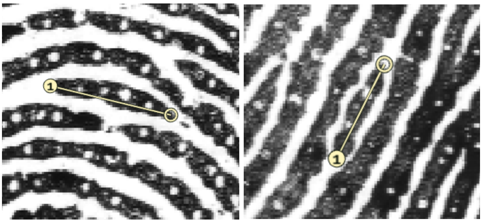

*Odcinek.*

---

### Mostek

Mostek to krótka listewka łącząca dwa równoległe listewki.

Cecha jest oznaczana od punktu rozwidlenia do punktu połączenia listewek.

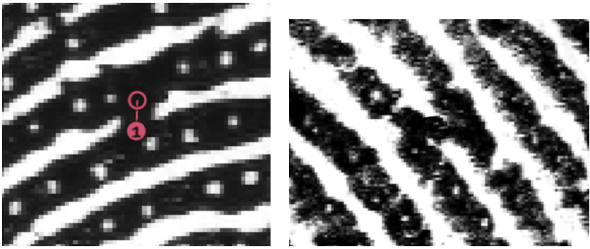

*Mostek.*

---

### Punkt

Punkt to bardzo mały izolowany fragment listewki.

Jego rozmiar nie powinien przekraczać w przybliżeniu dwukrotności szerokości listewki.

Cecha jest oznaczana za pomocą pojedynczego punktu.

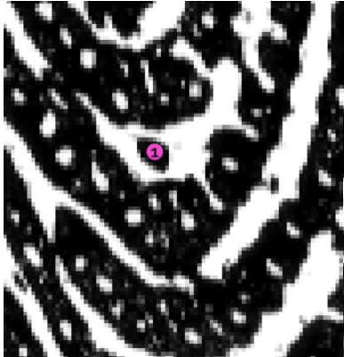

*Punkt.*

### Linia szczątkowa

Linia szczątkowa to słabo rozwinięta struktura listewki, której szerokość jest mniejsza niż połowa szerokości sąsiednich listewek. Linie szczątkowe są często przerywane i mogą pojawiać się jako niekompletne ślady listewek.

Cecha jest oznaczana od początku fragmentu listewki do jego zakończenia.

Linie szczątkowe mogą być wysoce charakterystyczne i mogą być przydatne podczas szczegółowych porównań, gdy pojawiają się konsekwentnie na wielu odciskach.

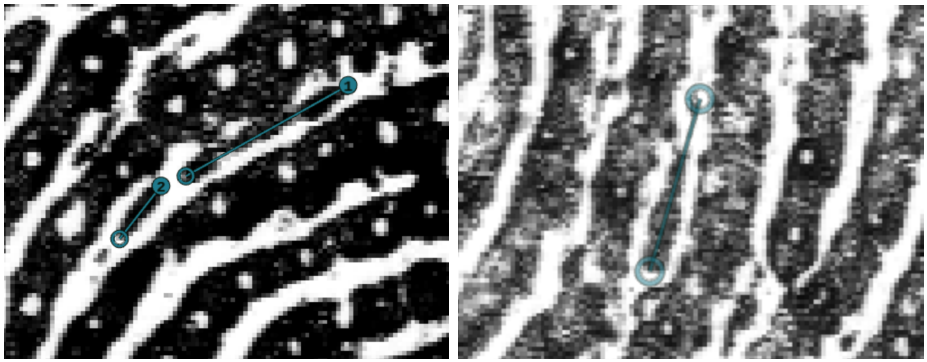

*Linia szczątkowa.*

---

### Pęknięcie

Zmarszczki to przerwania naskórka, które zazwyczaj wynikają ze starzenia się skóry lub jej suchości.

Pęknięcie pojawia się jako liniowe przerwanie przecinające wiele sąsiadujących listewek bez istotnej zmiany ich ogólnego przebiegu.

W praktyce Pęknięcie często wygląda tak, jakby mała część obrazu została wymazana.

Cecha jest oznaczana od jej początku do jej końca.

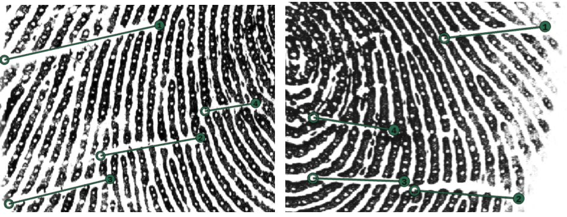

*Pęknięcie.*

---

### Blizna

Blizna to trwałe zaburzenie przebiegu listewek spowodowane urazem i gojeniem.

W odróżnieniu od zmarszczek, blizny wyraźnie zmieniają otaczającą strukturę listewek. Sąsiednie listewki mogą być ściągnięte, zniekształcone, przerwane lub przemieszczone wokół bliznowatego obszaru.

Cecha jest oznaczana od jej początku do jej końca.

Blizny są często wysoce indywidualizującymi cechami i mogą stanowić silne wsparcie podczas identyfikacji.

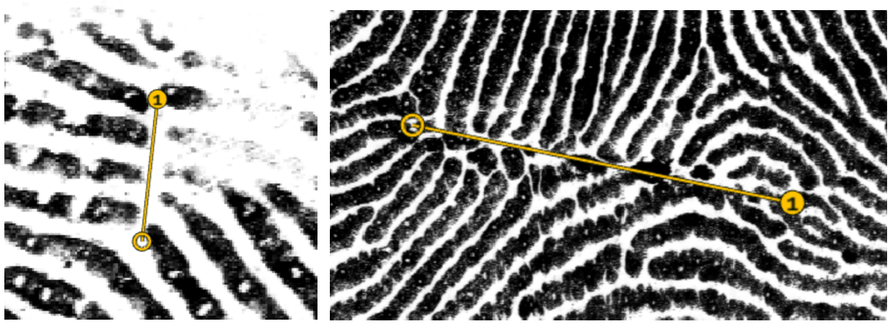

*Blizna.*

---

### Pory

Pory reprezentują trzeci poziom szczegółowości odcisków palców i odpowiadają otworom gruczołów potowych.

Chociaż poszczególne pory mogą nie zawsze nadawać się do porównania, niezwykłe cechy porów mogą być bardzo informacyjne.

Przykłady obejmują:

* Wyjątkowo duże pory
* Pory zlokalizowane przy krawędziach listewek
* Nieregularne kształty porów
* Charakterystyczne grupowania porów
* Nierównomierne rozkłady porów

Gdy pora lub układ porów pojawia się konsekwentnie na obu obrazach, może być używany jako cecha porównawcza.

Pory są oznaczane za pomocą adnotacji punktowych.

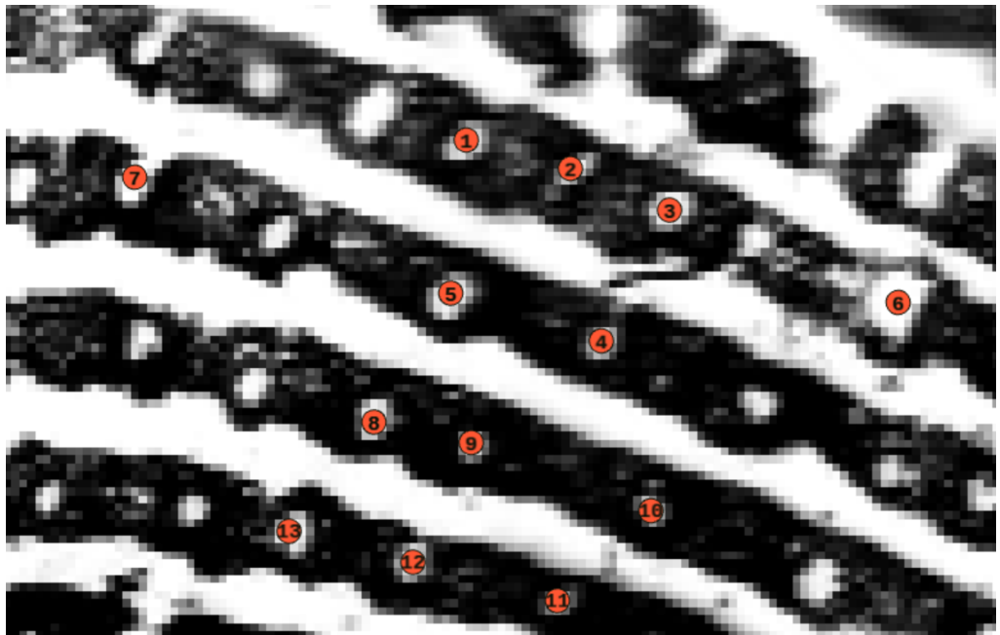

*Pory.*

---

### Wypust krawędzi

Wypust krawędzi to charakterystyczne wybrzuszenie na zewnątrz wzdłuż krawędzi listewki.

Takie wypukłości należą do dziedziny edgeskopii i mogą dostarczać wysoce dyskryminujących informacji podczas zaawansowanego badania odcisków palców.

Cecha jest oznaczana w miejscu wypukłości.

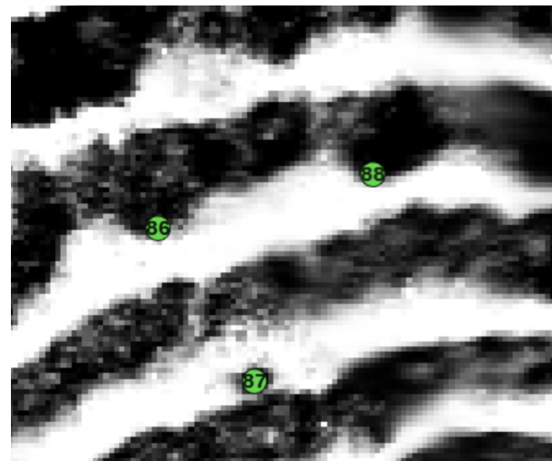

*Wypust krawędzi.*

---

### Wgłębienie krawędzi

Wgłębienie krawędzi to charakterystyczne wklęśnięcie do wewnątrz wzdłuż krawędzi listewki.

Podobnie jak wypust krawędzi, wgłębienia należą do analizy edgeskopowej i mogą być użyteczne gdy dostępne są obrazy wysokiej rozdzielczości.

Cecha jest oznaczana w miejscu wgłębienia.

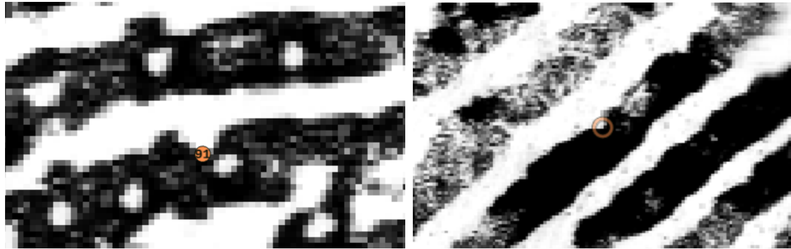

*Wgłębienie krawędzi.*

---

### Plamki

W suchych odciskach lub odciskach niskiej jakości, listewka może pojawiać się jako sekwencja odłączonych plamek, a nie ciągła listewka.

Układ i rozmieszczenie tych plamek może być charakterystyczne i dlatego może być używane jako cechy porównawcze, gdy są konsekwentnie obserwowane w wielu odciskach.

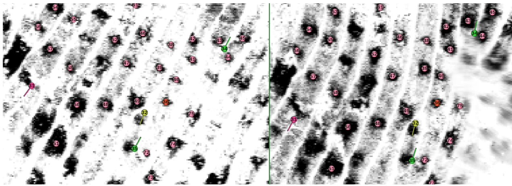

*Plamki.*

---

## 6.2 Raportowanie porównań odcisków palców

Głównym celem oznaczania cech jest dokumentowanie odpowiadających obserwacji między dwoma odciskami palców.

Typowy przepływ pracy porównania obejmuje:

1. Wczytanie obu obrazów.
2. Wyrównanie odcisków.
3. Oznaczenie cech Core i Delty.
4. Oznaczenie głównych minucji.
5. Oznaczenie cech drugorzędnych i trzeciorzędnych.
6. Przegląd przypisań cech.
7. Zapisanie plików adnotacji.
8. Wygenerowanie raportu porównania.

Ilość i jakość odpowiadających cech powinna być oceniana zgodnie z normami, procedurami i wymaganiami prawnymi obowiązującymi w jurysdykcji eksperta.

Oprogramowanie wspomaga dokumentację i wizualizację, ale nie określa automatycznie wniosków identyfikacyjnych.

---

## 6.3 Tryb odcisków butów

Tryb odcisków butów jest przeznaczony do porównania odcisków podeszwy obuwia, odcisków podeszew i powiązanych dowodów obuwniczych.

Przepływ pracy jest podobny do porównywania odcisków palców:

1. Wczytaj kwestionowany odcisk.
2. Wczytaj odcisk referencyjny.
3. Wyrównaj obrazy.
4. Oznacz odpowiadające charakterystyki.
5. Udokumentuj obserwowane podobieństwa i różnice.

### Typowe kategorie cech

Typowe cechy odcisków butów obejmują:

#### Cechy globalne

Charakterystyki wpływające na cały wzór podeszwy:

* Kształt podeszwy
* Kształt pięty
* Ogólne wymiary
* Układ wzoru

#### Cechy produkcyjne

Charakterystyki wynikające z procesu produkcji:

* Cechy formy
* Elementy wzoru
* Geometria wzoru

#### Cechy zużycia

Charakterystyki wynikające z normalnego użytkowania:

* Ścieranie
* Wzory zużycia
* Zaokrąglenie krawędzi
* Lokalne pogorszenie stanu

#### Cechy uszkodzeń

Indywidualizujące charakterystyki spowodowane uszkodzeniem:

* Nacięcia
* Rozdarcia
* Brakujące sekcje
* Wbudowane obiekty
* Ślady naprawy

Te charakterystyki mogą być reprezentowane za pomocą adnotacji punktowych, liniowych lub obszarowych w zależności od wymagań badania.

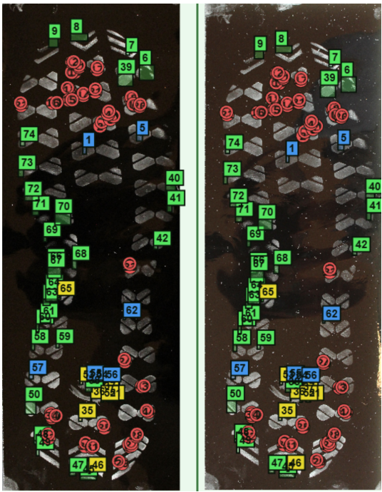

*Przepływ pracy porównania odcisków butów.*

---

## 6.4 Tryb odcisków usznych

Tryb odcisków usznych jest obecnie w trakcie opracowywania.

Tryb ten ma na celu wsparcie porównywania odcisków usznych i cech morfologii ucha.

Przyszłe wersje mają zawierać:

* Definicje punktów orientacyjnych ucha
* Specjalistyczne kategorie cech
* Przepływy pracy porównania odcisków usznych
* Dedykowane wsparcie raportowania

Ponieważ definicje cech są nadal opracowywane, funkcjonalność może się różnić między wydaniami.

---

# 7. Najlepsze praktyki

### Zachowuj oryginalne pliki

Zawsze przechowuj oryginalne pliki obrazów oddzielnie od plików adnotacji.

### Zapisuj często

Regularnie zapisuj pliki adnotacji w trakcie całego procesu badania.

### Używaj naprzemiennego wprowadzania cech

Naprzemienny sposób oznaczania cech minimalizuje błędy parowania i upraszcza późniejszy przegląd.

### Weryfikuj przypisania cech

Regularnie przeglądaj tabele cech, aby upewnić się, że odpowiadające identyfikatory reprezentują zamierzone pary cech.

### Dokumentuj znaczące cechy

Skup się na reprodukowalnych i wyraźnie widocznych charakterystykach.

### Używaj obrotu przed szczegółowym oznaczaniem

Gdy odciski są rejestrowane pod różnymi kątami, użyj Narzędzia obrotu przed rozbudowaną adnotacją cech.

### Zachowuj przejrzystość badania

Wszystkie wnioski powinny być reprodukowalne i niezależnie weryfikowalne przez innego eksperta.

---

# 8. Rozwiązywanie problemów

## Cechy wyglądają na nieprawidłowo wyrównane

Możliwe przyczyny:

* Obrazy nie są prawidłowo wyśrodkowane.
* Obrót nie został zastosowany.
* Nieprawidłowe przypisanie pary cech.

Zalecane działania:

* Ponownie wyśrodkuj oba obrazy.
* Użyj Narzędzia obrotu.
* Sprawdź identyfikatory cech.

---

## Numery cech nie zgadzają się

Możliwe przyczyny:

* Nie-naprzemienny sposób wprowadzania cech.
* Nieprawidłowe przypisanie pary.

Zalecane działania:

* Usuń nieprawidłowo przypisane cechy.
* Wybierz zamierzony wiersz tabeli.
* Odtwórz przypisanie pary.

---

## Brakujące definicje cech

Możliwe przyczyny:

* Ustawienia wstępne nie zostały zaimportowane.
* Pliki ustawień wstępnych zostały zmodyfikowane.

Zalecane działania:

1. Otwórz okno Typy.
2. Zaimportuj ponownie domyślny pakiet ustawień wstępnych.

---

## Zapisane cechy nie pojawiają się

Możliwe przyczyny:

* Wybrany nieprawidłowy plik JSON.
* Plik adnotacji należy do innego obrazu.
* Plik adnotacji jest uszkodzony.

Zalecane działania:

* Sprawdź nazwę pliku.
* Sprawdź powiązany obraz.
* Przywróć z kopii zapasowej, jeśli jest dostępna.

---

## Problemy z wydajnością aplikacji

Możliwe przyczyny:

* Bardzo duże obrazy.
* Wysoki poziom powiększenia.
* Duża liczba adnotacji.

Zalecane działania:

* Zmniejsz rozmiar obrazu.
* Tymczasowo ukryj etykiety cech.
* Zamknij nieużywane projekty.
