# User Guide

## 1. Installation and Initial Configuration

### 1.1 System Requirements

The application requires:

* Windows 10 or newer
* Display resolution of at least 1920×1080 recommended

> **Note:** A macOS version may function, but the Windows version is recommended for optimal performance.

### 1.2 Downloading the Application

1. [Open the project's GitHub Releases page.](https://github.com/BiometricsUBB/Forensic-Biometrics-Studio/releases)
2. Locate the latest stable release.
3. Expand the **Assets** section.
4. Download the installer package.


*Downloading the application from GitHub Releases.*

### 1.3 Running the Installer

1. Launch the downloaded installer.
2. Windows SmartScreen may display a warning indicating that the application is unrecognized.
3. Click **More Info**.
4. Click **Run Anyway**.
5. Proceed through the installation wizard by selecting **Next** until the installation is complete.

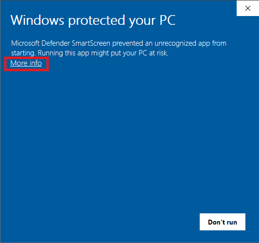

*Windows SmartScreen warning.*


*Installation wizard.*

### 1.4 First Launch

After installation, start the application from the desktop shortcut or the Start Menu.

When launched, the software will prompt you to select a working mode.

This mode can be changed later using the **Working Mode** menu.

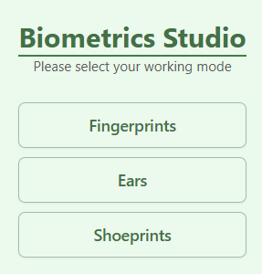

*Working mode selection.*

### 1.5 Application Settings

The Settings window allows you to configure:

* Language
* Light or Dark theme
* Interface behaviour

To open the Settings window, click the gear icon in the toolbar.


*Application settings.*

### 1.6 Importing Feature Type Presets

After installation, the application does not contain predefined feature definitions. These definitions must be imported from the supplied preset files.

To import presets:

1. Open **Settings**.
2. Open the **Types** window.
3. Click the **Import** icon.
4. Select the fingerprint preset file. There will be both Polish and English presets. Choose one.
5. Confirm the import.

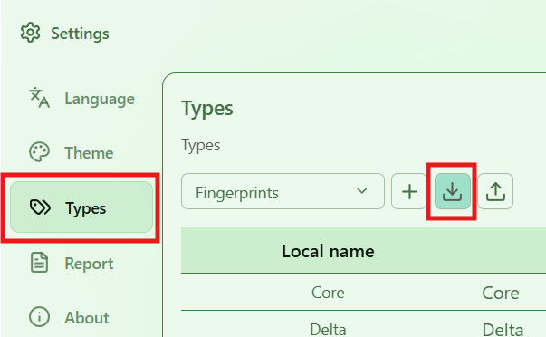

*Feature type management.*

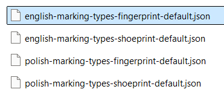

*Importing fingerprint presets.*

The imported definitions include the standard fingerprint feature types used throughout this guide.

> **Important:** Do not rename or delete existing feature definitions unless you intentionally want to create a custom configuration.


### 1.7 Recommended Workspace Configuration

For the most comfortable workflow:

* Use the application in maximized window mode.
* Use a mouse rather than a touchpad whenever possible.
* Enable Dark Mode when working in low-light environments.
* Use a high-resolution display for detailed forensic examinations.

---

## 2. Basic Workflow – Fingerprint Comparison

This section demonstrates the recommended workflow using fingerprint images.

### 2.1 Loading Images

The application is designed to compare two images simultaneously.

To load images:

1. Click the image loading icon in the left panel.
2. Select the first fingerprint image.
3. Click the image loading icon in the right panel.
4. Select the second fingerprint image.

After loading, both images should be visible side by side.


*Loading two fingerprint images.*

### 2.2 Navigating Images

The default navigation tool is the **Pan Tool**.

To move an image:

1. Select the hand icon.
2. Click and drag the image.

Reference lines are displayed while moving the image to assist with alignment.

For fingerprint comparison, it is recommended to position the image so that the approximate centre of the fingerprint pattern (Core region) is located near the centre of the viewing area.


*Pan Tool.*

### 2.3 Zooming

Use the mouse wheel to zoom in and out.

Zooming is essential when marking:

* Minutiae
* Pores
* Edge features
* Small scars
* Ridge details

The software preserves feature positions regardless of the zoom level.

### 2.4 Aligning Images

Before feature marking begins:

1. Locate the Core region on the left image.
2. Centre the image.
3. Repeat the process for the image on the right.

Both images should be approximately aligned before the comparison starts.


*Aligning images around the Core region.*

### 2.5 Locking Images

Once both images are aligned, they can be synchronized.

To enable synchronization:

1. Click the lock icon.

When image locking is active:

* Panning one image moves both images.
* Zooming one image zooms both images.
* Navigation remains synchronized.

This greatly simplifies feature comparison.


*Lock Tool.*

### 2.6 Switching to Feature Marking Mode

To begin marking features:

1. Click the crosshair icon.
2. Select a feature type from the feature list.

The currently selected feature type is displayed in the feature selection field.

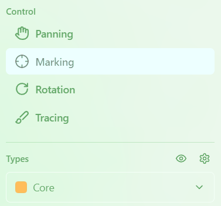

*Feature marking mode.*

### 2.7 Recommended Marking Procedure

The software is designed around alternating feature entry.

The recommended workflow is:

1. Mark a feature on the left image.
2. Mark the corresponding feature on the right image.
3. Continue alternating between images.

This approach automatically creates the correct feature pairs and decreases the number of assignment errors.

The following chapters provide detailed descriptions of the available fingerprint feature types and advanced pairing techniques.
### 2.8 Marking the Core

The Core is one of the most important reference features in fingerprint comparison and is usually marked before other characteristics.

To mark the Core:

1. Ensure that **Feature Marking Mode** is active.
2. Select **Core** from the feature type list.
3. Locate the central region of the fingerprint pattern.
4. Click once at the Core location on the first image.
5. Click once at the corresponding Core location on the second image.

The Core is represented as a point feature and therefore requires only a single click.


*Marking the Core feature.*

### 2.9 Marking the Delta

The Delta is a characteristic triangular or triradiate region formed by diverging ridge flows.

To mark a Delta:

1. Select **Delta** from the feature type list.
2. Locate the Delta on the first image.
3. Click once to mark its position.
4. Mark the corresponding Delta on the second image.

Like the Core, the Delta is represented as a point feature.


*Marking a Delta feature.*

### 2.10 Directed Minutiae

Many fingerprint features are directional.

Unlike point features, directional features require two clicks:

1. The first click defines the origin of the feature.
2. The second click defines the direction.

Examples include:

* Ridge Beginning
* Ridge Ending
* Bifurcation
* Ridge Joining

### 2.11 Ridge Ending

A Ridge Ending represents the termination of a ridge.

To mark a Ridge Ending:

1. Select **Ridge Ending**.
2. Click the ridge termination point.
3. Move the cursor in the direction of ridge flow.
4. Click again to confirm the direction.


*Ridge Ending.*

### 2.12 Ridge Beginning

A Ridge Beginning represents the start of a ridge.

To mark a Ridge Beginning:

1. Select **Ridge Beginning**.
2. Click the ridge origin.
3. Indicate the direction of ridge flow.
4. Confirm with a second click.


*Ridge Beginning.*

### 2.13 Bifurcation

A Bifurcation occurs when a ridge splits into two branches.

To mark a Bifurcation:

1. Select **Bifurcation**.
2. Click the location of the **Bifurcation**.
3. Indicate the ridge direction.
4. Confirm with a second click.


*Bifurcation.*

### 2.14 Ridge Joining

A Ridge Joining is the inverse of a bifurcation and represents two ridge paths merging into one.

To mark a Ridge Joining:

1. Select **Ridge Joining**.
2. Click the location of the **Ridge Joining**.
3. Define the direction.
4. Confirm with a second click.


*Ridge Joining.*

### 2.15 Understanding Feature Pairing

The software is optimized for alternating feature entry.

Example:

1. Mark Feature 1 on the left image.
2. Mark Feature 1 on the right image.
3. Mark Feature 2 on the left image.
4. Mark Feature 2 on the right image.

This workflow automatically creates matching feature identifiers.


*Alternating feature entry.*

### 2.16 Selecting Existing Features

Every marked feature appears in the feature table below the image.

Selecting a row in the table:

* Highlights the feature on the image.
* Makes it easier to review annotations.
* Allows corrections and deletions.

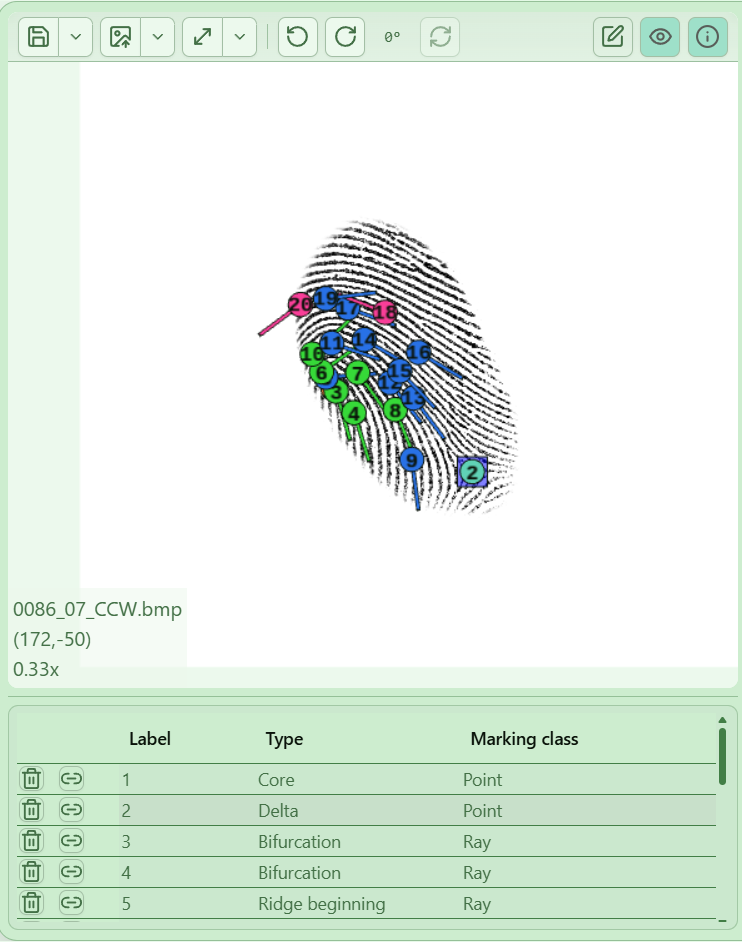

*Feature table and selection.*

### 2.17 Deleting Features

Incorrect annotations can be removed at any time.

To delete a feature:

1. Select the feature in the table.
2. Click the trash icon.
3. If prompted, confirm the deletion..


*Deleting an annotation.*

### 2.18 Working with Non-Alternating Annotations

Although alternating entry is recommended, it is also possible to mark multiple features on one image before marking their counterparts.

Example:

1. Mark features 4, 5, 6 and 7 on the left image.
2. Switch to the right image.
3. Add matching features.

In this situation, the software may continue numbering automatically rather than assigning the intended pair identifiers.

To correct this, do the following:

1. Select the empty row corresponding to the desired identifier.
2. Mark the matching feature.
3. Repeat until all pairs are correctly assigned.

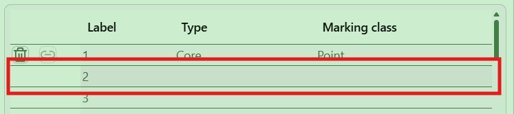

*Correcting feature pair assignments.*

---

## 3. Saving and Loading Work

### 3.1 Saving Feature Annotations

Feature annotations are stored separately from the original image files.

The application saves them as JSON files.

To save your work:

1. Click the save icon above the image.
2. Choose the destination.
3. Confirm the file name.

The original image will remain unchanged.


*Saving feature annotations.*

### 3.2 Recommended File Organisation

The application automatically suggests the following file names:

```text
fingerprint.bmp
fingerprint.bmp.json
```

Using the same directory and matching file names is strongly recommended because it simplifies loading those files in the future.

### 3.3 Loading Saved Annotations

To continue a previous examination:

1. Load the image file.
2. Click the annotation loading icon.
3. Select the corresponding JSON file.

The application will restore all saved feature information.


*Loading previously saved work.*

### 3.4 Working with Multiple Comparisons

A common workflow is to compare multiple impressions of the same source.

For example:

* Impression A vs Impression B
* Impression A vs Impression C
* Impression B vs Impression C

Each comparison may generate a separate JSON annotation file, which can be combined later using the Merge function described in the next chapter.

---

## 4. Advanced Workflow

### 4.1 Merge Function

The Merge function unifies feature identifiers from different annotation files.

This is particularly useful when:

* Multiple comparisons have been performed independently.
* The same physical feature has different identifiers.
* Existing annotations need to be reconciled.

### 4.2 Typical Merge Scenario

Consider two previously annotated image pairs.

The same Core feature may have:

* Identifier 1 in one comparison
* Identifier 7 in another

The Merge function combines these identifiers into a single, shared identifier.

### 4.3 Merging Features

To merge two features:

1. Select the feature row in the first table.
2. Select the corresponding feature row in the second table.
3. Click the Merge icon.
4. Repeat for all matching features.

The software updates the identifiers so that the corresponding features share the same reference number.

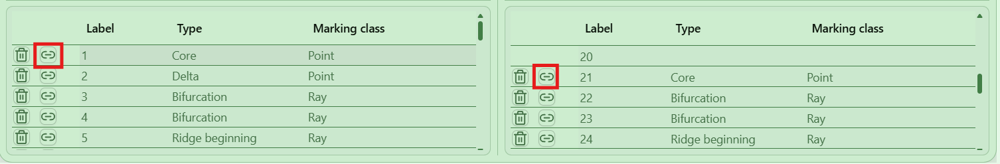

*Merging feature identifiers.*

### 4.4 Verifying Merge Results

After merging:

* Matching features should display identical identifiers.
* Tables should show consistent numbering.
* Feature relationships should remain unchanged.

Save the updated annotations after completing the merge process.

### 4.5 Rotation Tool Overview

Fingerprint impressions are often captured at different angles.

The Rotation Tool allows you to temporarily rotate the right image to simplify feature comparison while preserving feature coordinates.

The complete rotation workflow is described in the next chapter.
### 4.6 Automatic Rotation Tool

### Purpose

Fingerprint impressions are often captured at different angles. Even when two images originate from the same finger, differences in hand positioning, scanner placement, or acquisition conditions may result in rotational discrepancies.

The Rotation Tool provides a temporary alignment mechanism that allows the examiner to rotate the image for proper orientation.

The operation does not modify the original image file or alter the stored feature coordinates.

### Starting the Rotation Tool

To access the tool:

1. Open a comparison containing two fingerprint images.
2. Select the **Rotation Tool** from the sidebar.

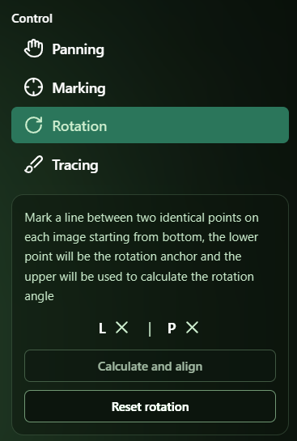

*Opening the Rotation Tool.*

### Selecting Reference Lines

The rotation algorithm requires a reference line on both images.

For best results:

* Select two clearly identifiable points.
* Use points that are visible on both images.
* Draw the longest possible line.
* Ensure both lines begin and end at corresponding locations.

To define the reference line:

1. Draw a line on the left image.
2. Draw the corresponding line on the right image.


*Defining reference lines.*

### Calculating Rotation

After both reference lines have been created:

1. Click **Calculate and Align**.
2. The software will calculate the angular difference.
3. The right image rotates automatically.


*Automatic alignment result.*

After rotation, both fingerprint patterns should have approximately the same orientation.

### Marking Features After Rotation

Once alignment is complete:

1. Return to Feature Marking Mode.
2. Continue marking features as usual.
3. Add new features as needed.

All annotations are automatically associated with the original image coordinates.

### Resetting Rotation

At any time:

1. Return to the Rotation Tool.
2. Click **Reset Rotation**.

The image will return to its original orientation.

Previously marked features remain correctly positioned relative to the fingerprint pattern.


*Resetting image rotation.*

---

## 5. Interface Functions

### 5.1 Opening Images

Loads a new image into the selected panel.

Supported image formats depend on the application version.

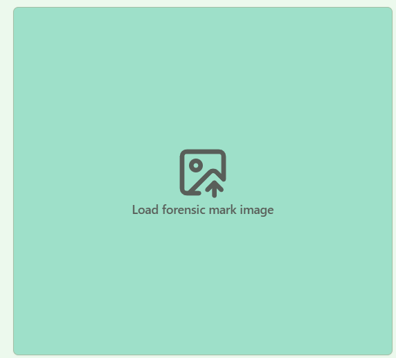

*Open image tool.*

### 5.2 Opening Annotation Files

Loads previously saved JSON feature annotations.

The image and annotation file can be loaded independently.


*Open annotation tool.*

### 5.3 Save Annotation File

Stores all feature information in a JSON file.

Only annotation data is saved.

The source image remains unchanged.


*Save annotation tool.*

### 5.4 Fit Image to Window

The software provides several automatic fitting options:

* Fit Entire Image
* Fit Width
* Fit Height

These tools simplify navigation after loading a new image.

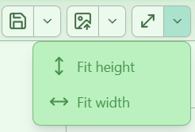

*Image fitting tools.*

### 5.5 Feature Visibility Control

When many features are present in a small area, annotations may obscure important image details.

The feature visibility control allows the examiner to reduce the visual prominence of displayed features.

Typical use cases:

* Dense minutiae regions
* Pore analysis
* Edgeoscopy examination


*Feature visibility controls.*

### 5.6 Hiding Information Overlays

The application can display:

* Zoom level
* Image coordinates
* Position indicators

These overlays can be hidden when they are not needed.


*Interface overlay controls.*

### 5.7 Light and Dark Themes

The application supports both:

* Light Theme
* Dark Theme

Dark mode is recommended for prolonged examination sessions and low-light working conditions.

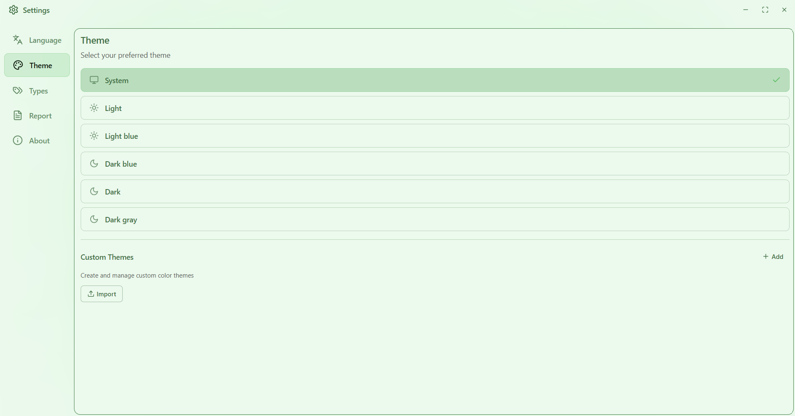

---

# 6. Working Modes

## 6.1 Fingerprint Mode

Fingerprint Mode provides the application's most complete functionality.

The following sections describe all supported fingerprint feature types.

---

### Core

The Core represents the approximate center of the fingerprint pattern.

It is typically found near the innermost curve of a loop or whorl.

The Core is marked using a single point.


*Core.*

---

### Delta

A Delta is a triangular, triradiate, or funnel-shaped region where ridge flow diverges.

The Delta serves as an important global reference feature.

The feature is marked using a single point.


*Delta.*

---

### Ridge Beginning

Represents the start of a ridge.

Marked as a directed feature.

The first click indicates the location.

The second click indicates ridge direction.


*Ridge Beginning.*

---

### Ridge Ending

Represents the termination of a ridge.

Marked as a directed feature.


*Ridge Ending.*

---

### Bifurcation

Occurs when a ridge divides into two branches.

Marked as a directed feature.


*Bifurcation.*

---

### Ridge Joining

Occurs when two ridge paths merge into one.

Marked as a directed feature.


*Ridge Joining.*

---

### Hook

A Hook is a short ridge branch extending from a longer ridge.

The branch length should not exceed approximately the distance between three neighboring ridges.

The feature is marked from the bifurcation point to the ridge ending.


*Hook.*

---

### Lake

An Lake is formed when a ridge bifurcates and then rejoins after a short distance.

The enclosed region should not exceed approximately four neighboring ridge intervals.

The feature is marked from the bifurcation to the Ridge Joining.


*Lake.*

---

### Island

An Island is an isolated ridge segment.

The feature:

* Begins independently.
* Ends independently.
* Does not connect to neighboring ridges.

The feature is marked from beginning to ending.


*Island.*

---

### Bridge

A Bridge is a short ridge connecting two parallel ridges.

The feature is marked from the bifurcation point to the Ridge Joining point.


*Bridge.*

---

### Point

A Point is a very small isolated ridge fragment.

Its size should not exceed approximately twice the ridge width.

The feature is marked using a single point.


*Point.*
### Incipient Ridge

A Incipient Ridge is a poorly developed ridge structure whose width is less than half the width of neighboring ridges. Incipient Ridges are often interrupted and may appear as incomplete ridge traces.

The feature is marked from the beginning of the ridge fragment to its termination.

Incipient Ridges may be highly characteristic and can be useful during detailed comparisons when they appear consistently across multiple impressions.


*Incipient Ridge.*

---

### Crease

Creases are interruptions in the epidermis that typically result from skin aging or dryness.

A Crease appears as a linear interruption crossing multiple neighboring ridges without significantly altering their overall course.

In practice, a Crease often appears as though a small portion of the image has been erased.

The feature is marked from its beginning to its end.


*Crease.*

---

### Scar

A Scar is a permanent disruption to the flow of the ridge caused by injury and the subsequent healing process.

Unlike Creases, scars visibly alter the surrounding ridge structure. Neighboring ridges may be pulled together, distorted, interrupted, or displaced around the scarred region.

The feature is marked from its beginning to its end.

Scars are often highly individualizing features and can provide strong support during identification.


*Scar.*

---

### Pores

Pores represent third-level fingerprint detail and correspond to sweat gland openings.

Although individual pores may not always be suitable for comparison, unusual pore characteristics can be highly informative.

Examples include:

* Exceptionally large pores
* Pores located near ridge edges
* Irregular pore shapes
* Distinctive pore groupings
* Non-uniform pore distributions

When a pore or pore arrangement appears consistently on both images, it may be used as a comparison feature.

Pores are marked using point annotations.


*Pores.*

---

### Ridge Protrusion

A Ridge Protrusion is a characteristic outward bulge along the edge of a ridge.

Such protrusions belong to the field of edgeoscopy and may provide highly discriminating information during advanced fingerprint examination.

The feature is marked at the location of the protrusion.


*Ridge Protrusions.*

---

### Ridge Indentation

A Ridge Indentation is a characteristic inward depression along the edge of a ridge.

Like Ridge Protrusions, indentations belong to edgeoscopic analysis and may be useful when high-resolution imagery is available.

The feature is marked at the location of the indentation.


*Ridge Indentations.*

---

### Spots

In dry or low-quality impressions, a ridge may appear as a sequence of disconnected spots rather than a continuous ridge.

The arrangement and distribution of these spots may be characteristic and can therefore be used as comparison features when they are consistently observed across multiple impressions.


*Spots.*

---

## 6.2 Reporting Fingerprint Comparisons

The primary purpose of feature marking is to document corresponding observations between two fingerprint impressions.

A typical comparison workflow includes:

1. Loading both images.
2. Aligning the impressions.
3. Marking Core and Delta features.
4. Marking primary minutiae.
5. Marking secondary and tertiary features.
6. Reviewing feature assignments.
7. Saving annotation files.
8. Generating a comparison report.

The quantity and quality of corresponding features should be evaluated according to the standards, procedures, and legal requirements applicable within the examiner's jurisdiction.

The software assists with documentation and visualization but does not automatically determine identification conclusions.

---

## 6.3 Shoeprints Mode

Shoeprints Mode is intended for the comparison of shoeprints, outsole impressions, and related footwear evidence.

The workflow is similar to fingerprint comparison:

1. Load the questioned impression.
2. Load the reference impression.
3. Align the images.
4. Mark corresponding characteristics.
5. Document observed similarities and differences.

### Typical Feature Categories

Common shoeprints characteristics include:

#### Global Features

Characteristics affecting the entire outsole pattern:

* Sole shape
* Heel shape
* Overall dimensions
* Pattern arrangement

#### Manufacturing Features

Characteristics resulting from the production process:

* Mold characteristics
* Design elements
* Pattern geometry

#### Wear Features

Characteristics resulting from normal use:

* Abrasion
* Wear patterns
* Edge rounding
* Localized deterioration

#### Damage Features

Individualizing characteristics caused by damage:

* Cuts
* Tears
* Missing sections
* Embedded objects
* Repair marks

These characteristics may be represented using point, line, or area annotations depending on the examination requirements.


*Shoeprints comparison workflow.*

---

## 6.4 Earprint Mode

Earprint Mode is currently under development.

It is intended to support the comparison of ear impressions and ear morphology features.

Future versions are expected to include:

* Ear landmark definitions
* Specialized feature categories
* Earprint comparison workflows
* Dedicated reporting support

Because the feature definitions are still under development, functionality may vary between releases.

---
# 7. Best Practices

### Maintain Original Files

Always preserve original image files separately from annotation files.

### Save Frequently

Save annotation files regularly throughout the examination process.

### Use Alternating Feature Entry

Alternating feature marking minimizes pairing errors and simplifies later review.

### Verify Feature Assignments

Review feature tables regularly to ensure that corresponding identifiers represent the intended feature pairs.

### Document Significant Features

Focus on reproducible and clearly visible characteristics.

### Use Rotation Before Detailed Marking

When capturing impressions at different angles, use the Rotation Tool before extensively annotating features.

### Preserve Examination Transparency

All conclusions should remain reproducible and independently verifiable by another examiner.

---

# 8. Troubleshooting

## Features Appear Misaligned

Possible causes:

* Images are not centered correctly.
* Rotation has not been applied.
* Incorrect feature pair assignment.

Recommended actions:

* Re-center both images.
* Use the Rotation Tool.
* Verify feature identifiers.

---

## Feature Numbers Do Not Match

Possible causes:

* Non-alternating feature entry.
* Incorrect pair assignment.

Recommended actions:

* Delete incorrectly assigned features.
* Select the intended table row.
* Recreate the pair assignment.

---

## Missing Feature Definitions

Possible causes:

* Presets have not been imported.
* Preset files were modified.

Recommended actions:

1. Open the Types window.
2. Import the default preset package again.

---

## Saved Features Do Not Appear

Possible causes:

* Incorrect JSON file selected.
* Annotation file belongs to a different image.
* Annotation file is corrupted.

Recommended actions:

* Verify the file name.
* Verify the associated image.
* Restore from backup if available.

---

## Application Performance Issues

Possible causes:

* Very large images.
* High zoom levels.
* Large numbers of annotations.

Recommended actions:

* Reduce image size if appropriate.
* Hide feature labels temporarily.
* Close unused projects.
